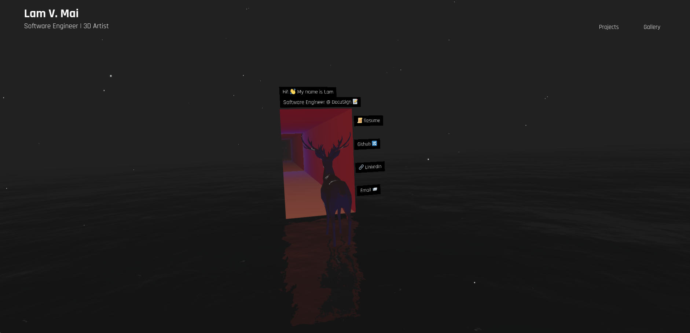

# My personal website   

I treated this as an experiment to create an interactive 3D art scene

   
#
What I used:
- **[⚛ React](https://reactjs.org/)**
- **[🧱 React-three-fiber](https://github.com/pmndrs/react-three-fiber)**
- **[👩‍🎤 Emotion](https://emotion.sh/docs/introduction)**
- **[🍶 Blender](https://www.blender.org/)** for 3D models
- ☕ Coffee
