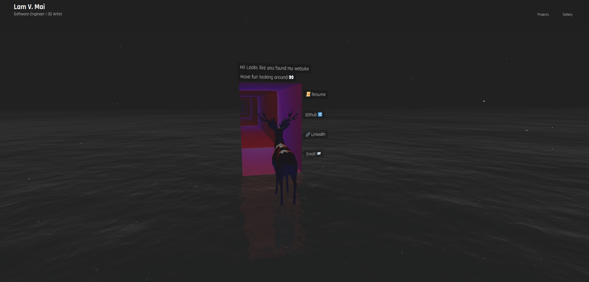

# Personal Website

I treated this as an experiment to create 3D scene
Developed portal logic from scratch using R3F in 1 week

Currently using this as a sort of playground for experimenting with Three.js and React
Hope to add more to this website in the future 🚧👷

#
What I used:
- **[⚛ React](https://reactjs.org/)**
- **[🧱 React-three-fiber](https://github.com/pmndrs/react-three-fiber)**
- **[👩‍🎤 Emotion](https://emotion.sh/docs/introduction)**
- **[🍶 Blender](https://www.blender.org/)** for 3D models
- ☕ Coffee
